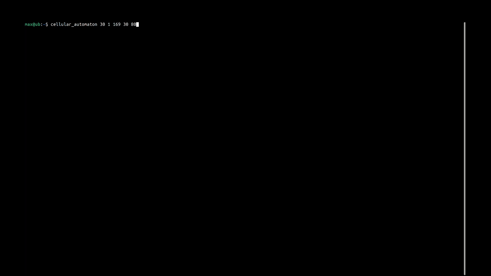

# Cellular Automata

Rudimentary implementation of very basic finite one-dimensional cellular automata. Ouputs the neighborhood-map for the given input and simulates the cellular automaton using the specified command line arguments.

## Parameters

`cellular_automaton [RULE] [NEIGHBORHOOD_RADIUS] [CONSOLE_WIDTH] [NR_ITERATIONS] [DELAY_MS] [RULE_IN_BITS]`

where

-   `RULE` specifies the rule for the cellular automaton. For a very brief introduction look [here](https://en.wikipedia.org/wiki/Cellular_automaton#Elementary_cellular_automata)
-   `NEIGHBORHOOD_RADIUS` specifies how many cells to the left and right of each cell will be looked at. With the standard 256 "elementary" cellular automata, this value is 1. This particular implementation allows to widen the neighborhood. Note that since the bits of the `RULE` (or `RULE_IN_BITS` respectively) determine the mappings of neighborhoods, you will probably want to adjust that argument as well when playing with this.
-   `CONSOLE_WIDTH` specifies the width of the output in characters. If you want the output to stretch your entire window but are not sure how wide it is, run `tput cols`.
-   `NR_ITERATIONS` specifies the number of iterations the simulation should run for. When set to 0 the value will automatically be set to INT_MAX.
-   `DELAY_MS` specifies the delay between each frame in ms (i.e. $\frac{1}{FPS}$).
-   `RULE_IN_BITS` specifies the `RULE` in bits, meaning explicitly giving the rule in its binary representation. This might be necessary when the number of required values exceeds 32 bits and does therefore not fit into a (standard) integer anymore. Note that providing this value **will override whatever is specified in `RULE`**. Also note that the number of bits specified has to be equal to $2^{NEIGHBORHOOD\\_RADIUS * 2 + 1}$.

## Examples

